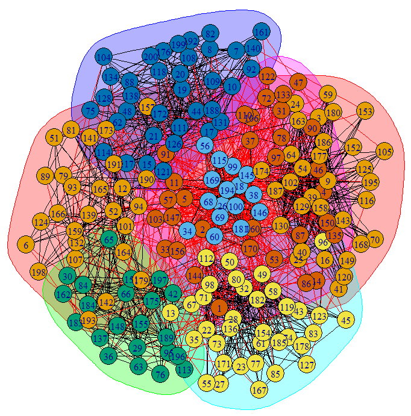
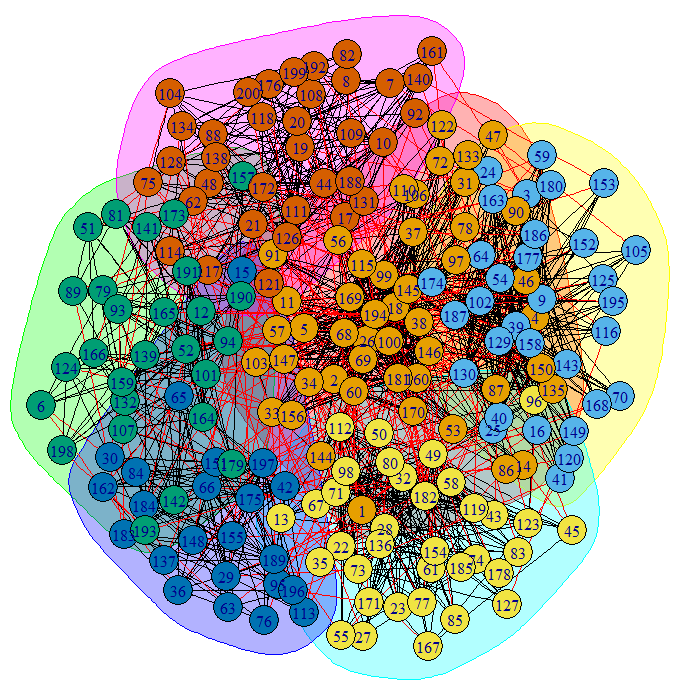

# Deep_KMeans
Sample R code implementing the Deep K-Means algorithm, as described by the paper "Deep Learning with K-Means Applied to Community Detection in Networks", which can be found at: http://snap.stanford.edu/class/cs224w-2014/projects2014/cs224w-31-final.pdf

The sample R code provided here uses a synthetic network comprised of 200 vertices, 1548 edges, and 6 defined communities. It runs both Spectral Clustering and Deep K-Means to try to identify those communities.

By running the code, the following results are obtained:

Spectral Clustering Accuracy: 0.8974848

Deep K-Means Accuracy: 0.987692

Visualization of the communities found by Spectral Clustering:

Visualization of the communities found by Deep K-Means:
